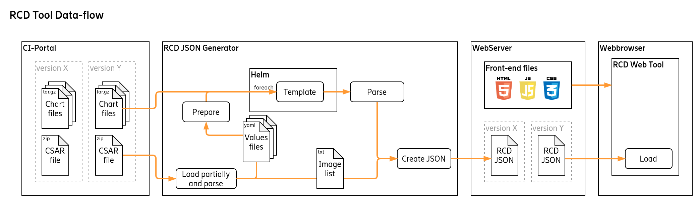
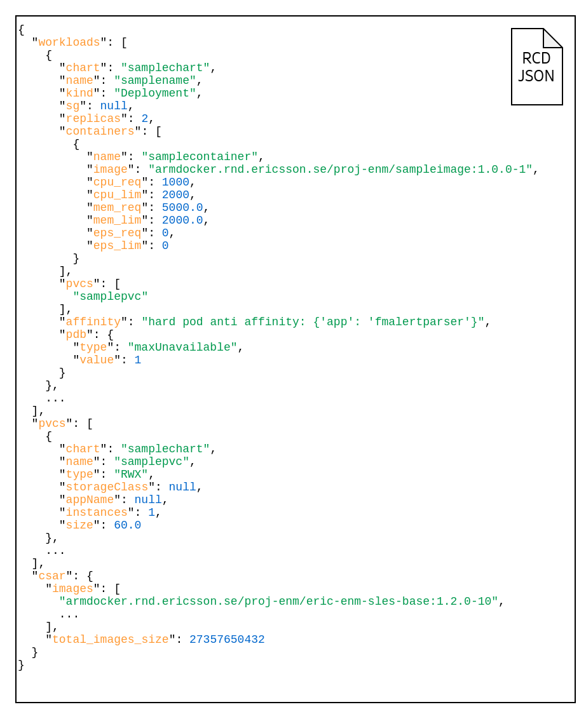

# Web-RCD

## Jenkins

[Precommit Pipeline](https://fem16s11-eiffel004.eiffel.gic.ericsson.se:8443/jenkins/job/eric-enm-resource-configuration-data_precommit/)

[Release Pipeline](https://fem16s11-eiffel004.eiffel.gic.ericsson.se:8443/jenkins/job/eric-enm-resource-configuration-data/)

## Production

https://resourceconfigurationdata.internal.ericsson.com/

## MT Internal Green build Product sets

https://resourceconfigurationdata.internal.ericsson.com:8888/

## Repo

[Gitiles](https://gerrit-gamma.gic.ericsson.se/plugins/gitiles/OSS/ENM-Parent/SQ-Gate/com.ericsson.oss.containerisation/eric-enm-resource-configuration-data/+/master)

[Code Review](https://gerrit-gamma.gic.ericsson.se/#/q/project:OSS/ENM-Parent/SQ-Gate/com.ericsson.oss.containerisation/eric-enm-resource-configuration-data)

## Main architecture

## RCD JSON

