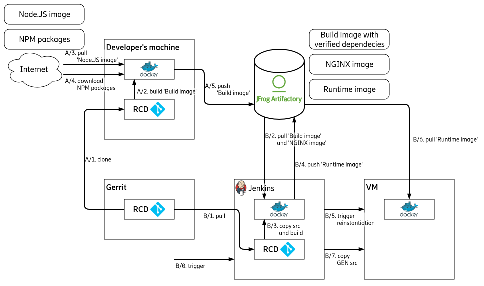

# Hosting RCD

RCD tool is hosted as a container running on a VM in [e2c](https://estart.internal.ericsson.com/).

The reproducible build is ensured by storing all the dependencies in a base container image in [artifactory](https://<insert-artifactory-repo-url-here>). (Flow A on the figure below)

Therefore any code-change (which does not involve dependencies) can be safely reflected in the running instance. Jenkins builds the runtime image by using the previously stored base image for bundling the front-end and NGINX image for the final image. This new image gets stored in artifactory as well. Then Jenkins triggers the VM to reload the runtime image and container. And lastly copy the generator script over the VM, so new ENM versions can be added by using only the VM. (Flow B on figure below)



## Usage

Remote steps (0 and 3) require authentication. Therefore, make sure SSH login is working in advance.

During VM setup docker gets set-up correctly on that.
Similarly, those steps which are running locally (1 and 2) also requires Docker Python SDK to be installed.

Docker registry push related steps (1 and 2) also require authentication towards artifactory server.

**TODO**: add Jenkins user to permitted users


### 0. Setup VM
```bash
ansible-playbook -k -i seliius20096.seli.gic.ericsson.se, 0_Setup_VM.yaml
```

### 1. Build Base image and Testrunner image, then save those and NGINX image to artifactory
```bash
ansible-playbook 1_Save_Deps.yaml
```

### 2. Build Runtime image from base and NGINX image, and save that to artifactory
```bash
ansible-playbook 2_Build_Runtime.yaml
```

### 3. Deploy Container from Runtime image
```bash
ansible-playbook -k -i seliius20096.seli.gic.ericsson.se, 3_Deploy_to_VM.yaml
```
