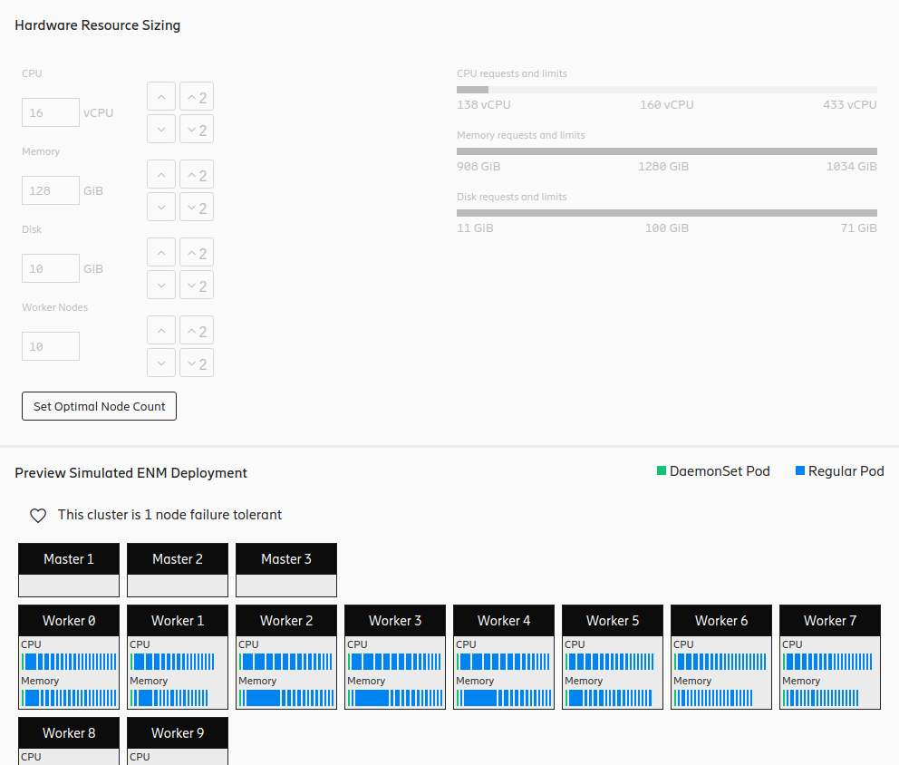

# Components

## App

This is the main components of the app.
It provides the layout of the site by following EDS (Ericsson Design System) principles.
This project uses only the styling from EDS, but in order to make that work the HTML also must conform to the rules of EDS.

---

## Drop Down Select

It's a simple wrapper around the drop-down visual of EDS to make it easier to use in Vue.

### Props:
- **options** (Array\<object\>): list of selectable objects
- **displaykey** (string): name of the field, which will be displayed from each item
- **default** (string): name of the field, which will be displayed as selected by default

### Emits:
- **select** (number): the index of the selected item

---

## DeploymentSetup

The simple component, which is displayed upon navigating to `/deploymentsetup` route.

It prepares reactive model based on the selection of Deployment Size and Version.

---

## Overview

The simple component, which is displayed upon navigating to `/overview` route.

It only displays reactive fields from the model.

---

## Workloads

This route component displays the details of all the workloads.

It uses the *Super Table* component for rendering the table.
This component only implement two customization to that reusable table component:
expand/collapse all buttons and the expanded area.

---

## Storage

Route component for `/storage`, which also uses *Super Table* to display the list of PVCs and ephemeral storage.

---

## Images

Displays the CSAR part of the model: total size of images and list of images.

This table is also a *Super Table*.

---

## Super Table

A reusable table component, which follows EDS style.

It can sort and filter the records by the configured columns.
Each column can have a prefix and a unit.
The user component can specify the top-right table header part, and the expanded view of a record.
Row expansion is optional.

### Props
- **records** (Array\<object\>): List of records
- **fields** (Array<Field>): List of fields available in records

    interface **Field** {\
    &nbsp;&nbsp; **name**: string\
    &nbsp;&nbsp; **key**: string\
    &nbsp;&nbsp; **type**: "text" | "oneOf" | "has" | "num"\
    &nbsp;&nbsp; **options**?: Array\<String\>\
    &nbsp;&nbsp; **sortable**: boolean\
    &nbsp;&nbsp; **filterable**: boolean\
    &nbsp;&nbsp; **prefix**: string\
    &nbsp;&nbsp; **unit**: string\
    }

- **expandable** (boolean): If rows can be expanded

---

## Node Calc

Uses *Num Input* component for user input, and *Req Lim Bar* to display the amount of currently given resources between the required and maximum values.

Under this part, there is the preview of a simulated sample scheduling of the cluster.
It uses directly the output of the simulation from the model.

Calculation of the optimal node count is implemented in the model too.
Only the initial estimation gets computed here.
That is required, because the optimization uses an iterative approach.

The visualization heavily uses CSS flex-boxes to fill the available screen space properly.

---

## Num Input

A customized numeric input field built on top of EDS.

It applies user typed value only after user approval.
Has browser-independent inc/decrease buttons.
And the user can step straight to the next smallest or previous biggest power of 2.

All kind of user inputs consider the given minimum value, which is automatically set if the user tries to go below that.

### Props
- **modelValue** (number): reactive value for the input field
- **min** (number): reactive minimum value
- **label** (string): name of the field, displayed above the input field
- **unit** (string): unit of the field, displayed after the input field

### Emits
- **update:modelValue** (number): the new value of the field

---

### Props
- **res** (Resource): the resource definition object

    interface **Resource** {\
    &nbsp;&nbsp; **name**: string\
    &nbsp;&nbsp; **unit**: string\
    &nbsp;&nbsp; **sumscale**: number\
    &nbsp;&nbsp; **wlkey**: string\
    }
